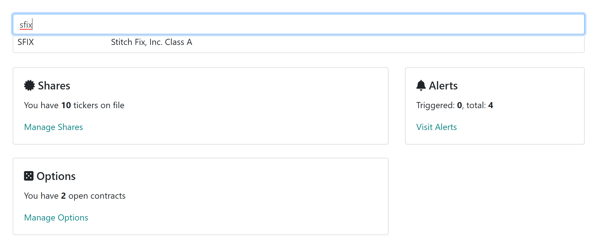
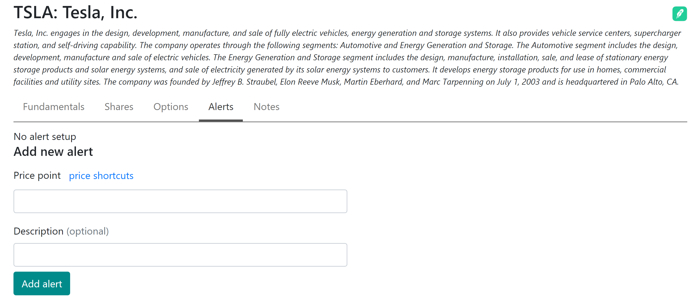
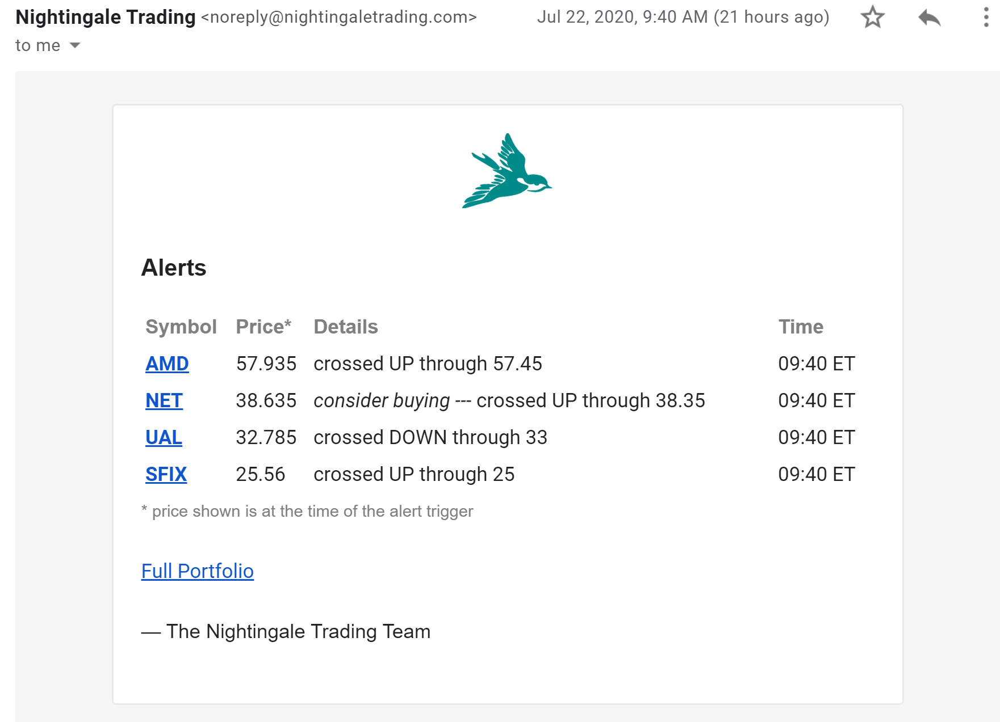

## How to setup an alert

First, find the ticker of your interest from the dashboard. For example, we will start by finding Stitch Fix (sfix):

Selecting the result brings us to the stock detail page where you can select "Alerts" tab:

Now you need to provide the following:

* Price point: the price level that interests you, in dollars per share
* Description: optional description that can remind you why you setup the alert

Once you press Add alert, congratulations, you have just turned on an alert.

## Receiving alerts

During the market hours if your alert is triggered, you will get an email informing you of the price change:

The prices are checked every 10 minutes and if there are multiple price points triggered, all of them are included in the notification.

You can see the current price of the ticker, which price point was triggered, and if you had a description - it's shown as well.