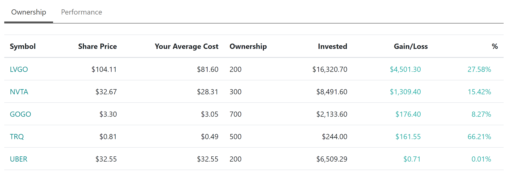
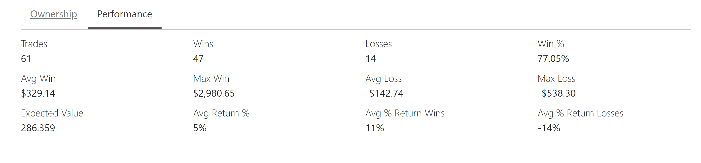
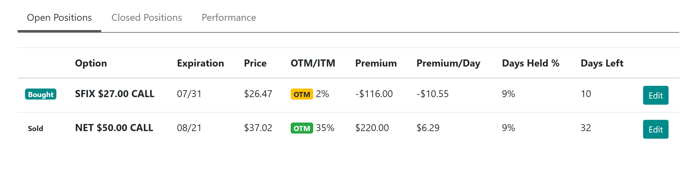
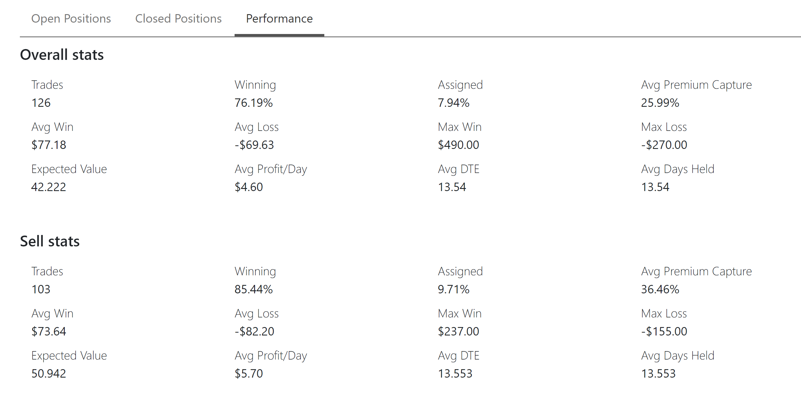
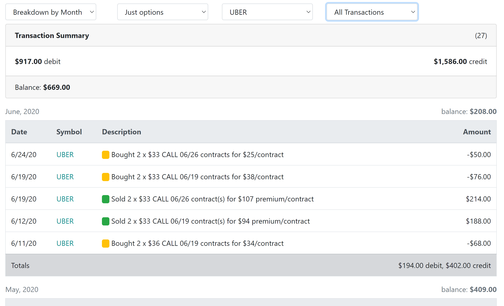

## Become a better trader with Nightingale Trading!

#### Use it to understand your trading performance.

Especially when it comes to options, getting an insight into your profits and losses can be hard.

What's your average rate of return across all trades? How bad are your drawdowns? How high are your max gains? Is your strategy a winning one?

To get answers to these questions requires work. Nightingale Trading eliminates as much of it as possible. Using its insights you can adjust your strategy for better returns.

There are three key areas you should use to take the full advantage of the platform.

### 1. Track share transactions

Use Nightingale Trading to record your share purchases and sells. We keep track of all the transactions and over time you can see your performance metrics. How many of your trades result in a profit, how large are you gains, what is your average rate of return, and many other questions will get answered.

With a quick glance you can see your positions and their relevant metrics:

As well as your overall performance for your closed positions:

### 2. Track option transactions

Nightingale Trading really shines when you use it to track your option trades.

First, we keep options separate from shares so that you can focus on one thing at a time.

Second, we provide you with an overview of your open positions that will tell you quickly what is in the money, out of the money, by how much, etc.

The information is kept up to date. You will know how close you are to being in the money, or out of the money, how many days you have held the contract, etc.

These could be important factors in helping you to decide the next action you should take.

After you start closing the trades, we will keep track of your winning rate, **profit capture** percentages, expected value, average win, the average days held and more.

This is the insight that you need to understand how you are performing.

### 3. Stock Alerts

Awareness of the price movements is key for entering or exiting the trades at the right time. The problem is that we don't have the time available to us to watch the tickers all day.

Nightingale Trading allows you to setup as many alerts as you like and then pings you when the alert is triggered.

It's too easy to miss a stock move, use the alerts to keep yourself informed.

## Other ways that Nightingale Trading can help

### Journaling

By recording your transactions you are already ahead of many of the traders. If you keep track of your moves and review your results regularly, you get a clear understanding of your outcomes that's based on statistics and not on perception.

Nightingale Trading goes a step further and allows you to record your thoughts for any ticker or transaction so that you can keep track of your thinking process and your analysis. The notes are always there for you to refer back and examine, review, and learn.

### Reporting

Nightingale Trading provides you with transcation logs, allowing you to filter down by ticker, by trade type (option or share), and focus in on either just profits/losses and just the transactions.

Here we have an example of a trader trading UBER options, and they can see all of their transactions made and filter them out further. Any ticker that you trade becomes available as a filter in the transactions screen.

The reports are continuously growing in their size and usefulness, so check back often for more.

## Get an account today if you haven't already done so at [nightingaletrading.com](https://www.nightingaletrading.com)

