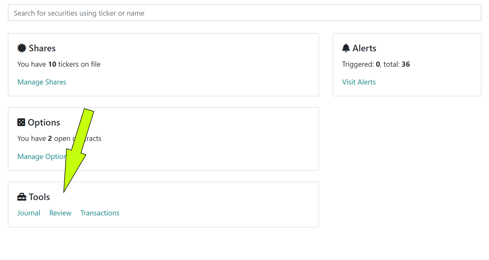
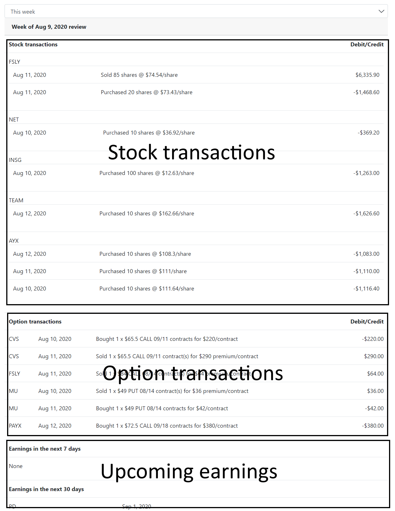

## Why Review

We have found many articles and trading experts touting the benefit of going over your trades regularly and reviewing your actions.

We agree that it's a very important step in becoming a better trader and offer a way for you to quickly see how you perform.

## Our recommended approach

At the end of the trading week login to Nightingale Trading and navigate to Review section under "Tools":

Clicking on the tool will bring you to your review screen:

Let's break the screen down highlighting each section below.

## Stock transactions

This is where we will list all of your recorded sells and buys. If you maintain a trading journal or diary of sorts, this list makes it easy for you to copy the last and paste it into your journal.

You can then go over each trade and re-affirm why you made the move, if you closed out a position, consider giving yourself a grade or just evaluating the trade and how you did.

If a trade was a mistake or a rash decision, you should attempt to understand why you made the move and how you could avoid it in the future.

This step in the process could be very personal to each trader, and our list will make it easy for you to put your thoughts down.

## Option transactions

Similar to shares, the option transaction area will show you all of the option moves you did for the week and will make it easy for you to grab the list and journal around it.

## Upcoming earnings

As you prepare for the next week ahead, we highlight which of your holdings (shares or options) have upcoming earnings events that you might want to keep in mind.