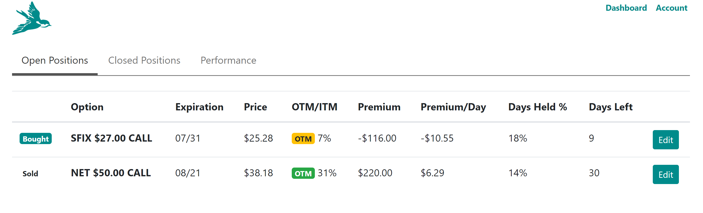
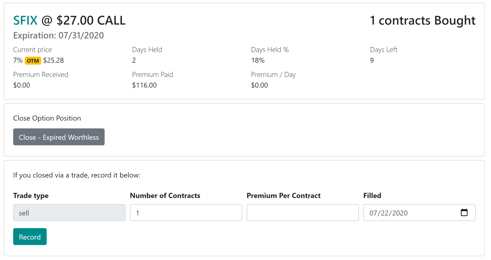
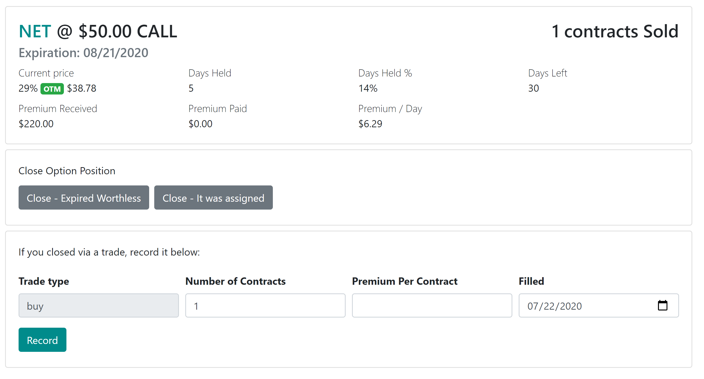

## How to close options position

When you are in options dashboard, select the "Edit" button on the options contract that you closed.

The closing methods will slightly vary depending on if you bought or sold option contracts. Let's visit each scenario separately.

### Closing purchased option

If we click on the Edit for the SFIX option shown above, you will see a screen that looks something like this:

You can see all the useful statistics about the option and the choices for closing it.

1. You can click "Close - Expired Worthless" if you held the option through the expiration and it was not exercised.

2. You can close it via trade. Since you bought the option, you can sell it back and record the sale by specifying the number of contracts you sold, how much premium you received PER CONTRACT (not per share) and then it was filled.

### Closing sold option

If we click on the Edit for the NET option shown above, you will see a screen that looks something like this:

You can see all the same statistics as for purchased options, but closing it now has some additional wrinkles.

1. You can click "Close - Expired Worthless" if you held the option through the expiration and it was not exercised.

2. You  can click "Close - It was assigned" if you took the option assignment.

3. You can close it via trade. Since you sold the option, you can buy it back and record the sale by specifying the number of contracts you bought back, how much premium you received PER CONTRACT (not per share) and then it was filled.