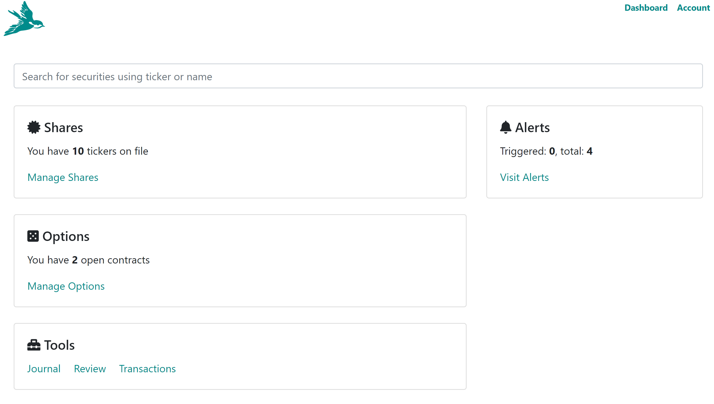

## Open Option positions

Whenever you login into Nightingale Trading, you are bought to the dashboard and one of the areas on the dashboard is dedicated to options:

Clicking on Manage Options brings you to options dashboard:

At a quick glance you can see what options you have open, are they in the money or out of the money, by how much, and other useful options information.

## Closed Positions

As you start closing option positions, they are still available for you to review under "Closed Positions" tab. The information is provided in a list that you can regularly review:

The focus is on showing what's important: was it a winning trade, how much premium was captured, how long was the option held. You can always see more by going into option details.

## Performance

As you track options, Nightingale Trading keeps track of your overall performance which you can see by checking out "Performance" tab:

Review your performance regularly to make sure you are trending in the right direction and your strategy is a winning one.