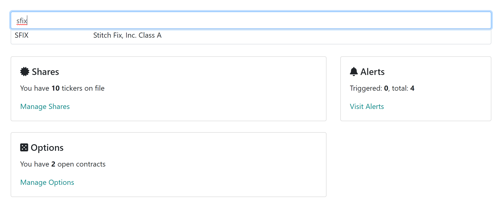

## How to record an option position

Regardless if you sell or buy option contracts, you record the opening by first finding the ticker from the dashboard. For example, we will start by finding Stitch Fix (sfix):

Selecting the result brings us to the stock detail page where you can see select "Options" tab:

Ticker is already preselected for you. Now you need to provide the following:

* Strike Price: option's strike price in dollars
* Expiration date: the date that option expires
* Option Type: was it a call or a put
* Number of Contracts: how many contracts were used in opening the transaction
* Premium per Contract: how much premium was received per CONTRACT (not per share), in dollars
* Did you buy or Sell: was this a short or long position
* Fill date: the date that the order was performed - useful in capturing the number of days the option is held
* Note: any thoughts/notes around this transaction for journaling purposes

Once you press Record, congratulations, you have just recorded your first transaction! The system captures the details and now the option is available in your open options screens.