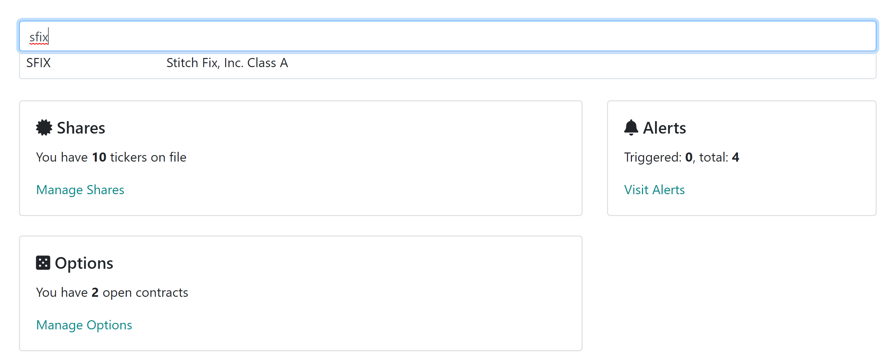
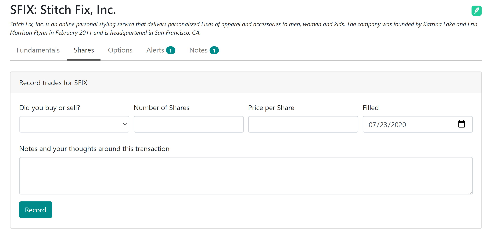

## How to record a stock transaction

Regardless if you sell or buy the shares, you record the transaction first by finding the ticker from the dashboard. For example, we will start by finding Stitch Fix (sfix):

Selecting the result brings us to the stock detail page where you can see select "Stocks" tab:

Ticker is already preselected for you. Now you need to provide the following:

* Did you buy or Sell: was this a short or long position
* Number of Shares: how many shares did you buy or sell
* Price per Share: price paid, per share
* Filled: the date that the order was performed
* Note: any thoughts/notes around this transaction for journaling purposes

Once you press Record, congratulations, you have just recorded your share transaction!