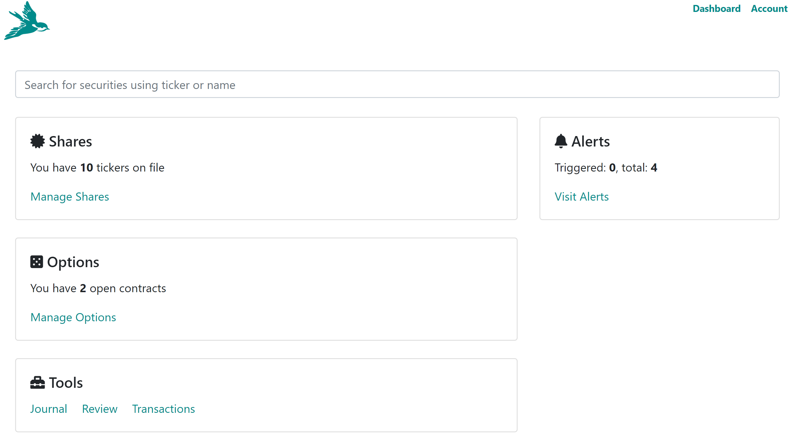
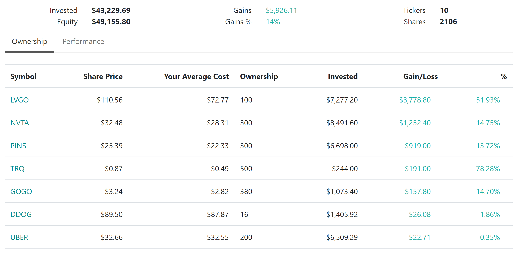
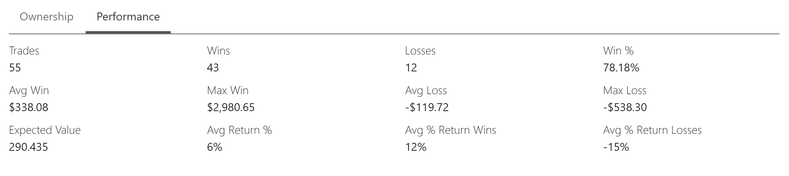

## Tracking your positions

Whenever you login into Nightingale Trading, you are bought to the dashboard and one of the areas on the dashboard is dedicated to stocks:

Clicking on Manage Shares brings you to stocks dashboard:

Again, we want to make sure you have all the key information available to you right away. You can see your overall account size, gain/loss, and individual ticker breakdown.

## Performance

As you track your trades, Nightingale Trading keeps track of your overall performance which you can see by checking out "Performance" tab:

Review your performance regularly to make sure you are trending in the right direction and your strategy is a winning one.